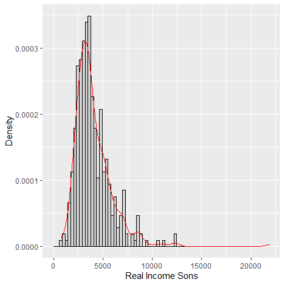
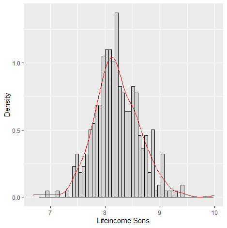

# Like Father, Like Son - intergenerational income mobility for Germany

## 1 Objective and Structure of the Analysis:
Estimation of the economic mobility of Germany and to find regional differences of intergenerational income elasticities in Germany. The underlying theoretical model is the human capital theory.

The data preparation and linear regressions are conducted in the stata do-files. The visualizations, quantile regressions und transition matrices are conducted in the r scripts.
Every step is described in detail within the scripts. Nevertheless, this readme provides the additional econometric framework in addition to the codes. 

## 2 Methodology of Analysis:

Empirical strategy: identify correlation between the long-term income 𝑌(*i,g*) of the child in generation *g* and his social parent in generation *g-1*, in family *i*:


Since there is no data available for lifetime income, this has to be estimated. Estimation therefore follows a two-step process:

1. lifetime income
2. mobility coefficient

This is conducted with the following methods:

Log-log OLS, Quantile Regression, Transition Matrix  


### 2.1 Measuring Lifetime Income

To estimate the lifetime income, one has to use actual observable income data. 


with Y(*i,g,t*) being observable income of generation child of family *i* in year t. But, careful; error-in-variables bias emerges. Workers with higher lifetime earnings tend to enter the labor market later than workers with shorter education periods.

Basically this means, if you go to college, you probability start working later in life than your peers who started working right after highschool. Since we want to estimate the lifetime income and use real income data, it is not optimal to use income data of a college student who might earn less at the age of 22 but eventually might earn more after college.

So to solve for this bias, the estimation excludes income observations from before the age of 30 and after the life of 50.
```
drop if age <30
drop if age >55
```
In addition to that, control variables for *age*, *age squared* and the *number of years in a child's income* are generated and introduced in *Z(i,g-1)* and *W(i,g*).

```
bys cid: egen first_observation = min(syear)
bys cid: egen last_observation = max(syear)
gen nryrs = .
replace nryrs = last_observation - first_observation
label variable nryrs "number of years in son’s earnings average"
```
This leads to the estimation equation:  


### 2.2 Data and Sample Selection

The longitudinal survey of the Socio-Economic Panel (SOEP) is used which captures representative data from 1984-2017.  
DOI: 10.5684/soep.v34  
Collection period: 1984-2017  
Publication date: 2019-03-05  

The individual labor income variable covers gross income and salary from all employment before deduction of taxes and social security, unemployment and health insurance.
**Important sample restrictions**:  

- drop observations under 400€ a month - since it is assumed that this would be a mini-job, not a real living wage  
- drop ids for which there are less than 5 observations available. Estimating life-income on less income-data points introduces bias
- use only male observartions - income observations for women in 1980s may introduce a bias to the data  

```
drop if incomeS <400
drop if counter_pid <5
drop if sex == 2
```

After the data for both sons and fathers are prepared, both samples have to be merged over the father id (fnr)

```
use "C:\Users\...Sons.dta"
merge 1:1 fnr using "C:\Users\...Fathers.dta"
```
The individuals who did not match have to be droppped, leaving only father-son pairs. 

```
drop if income_s == .
drop if income_f == .
drop _merge
```
Now, if we take a step back and look again at the income observations for sons in the first graph, we see that the income variable is not normal distributed but rather skewed. In order to meet all of the assumptions of the OLS, the variable should be normal distributed. Thus, we change the income variables of sons and fathers to a log income variable. The second graph shows the distribution after the log.




This can also be done after the merging of the data. 
```
gen log_incomeS_mean = ln(income_s)
gen log_incomeF_mean = ln(income_f)
```


## 3. Empirical Results


## 4. Conclusion


